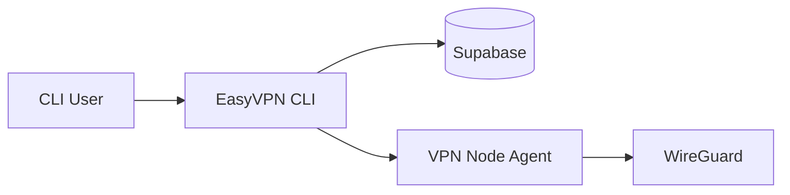
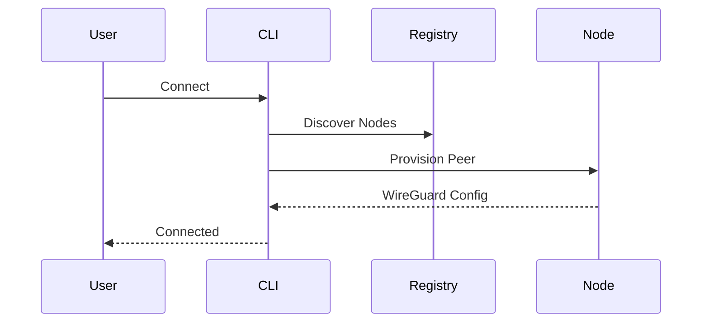

# ⚡ EasyVPN CLI

> Cross-platform command-line client for discovering, provisioning, and connecting to EasyVPN WireGuard networks.

<p align="center">
  <strong>Discover • Connect • Secure • Automate</strong>
</p>

<p align="center">
  One CLI. Linux, Windows, and macOS.
</p>

---

## Overview

EasyVPN CLI is the official command-line client for the EasyVPN ecosystem.

It provides a simple, unified experience for connecting to WireGuard-based VPN infrastructure without requiring users to manually manage peers, generate configurations, or edit networking files.

The CLI handles discovery, provisioning, tunnel management, and connection lifecycle management across supported operating systems.

---

## Tech Stack

<p align="center">
  
  &nbsp;&nbsp;
  
  &nbsp;&nbsp;
  
  &nbsp;&nbsp;
  
  &nbsp;&nbsp;
  
  &nbsp;&nbsp;
  
</p>

---

## Repository Ecosystem

| Component                  | Repository                                     |
| -------------------------- | ---------------------------------------------- |
| VPN Backend Infrastructure | https://github.com/Erebus9456/EasyVPN-Backend  |
| Frontend Dashboard         | https://github.com/Erebus9456/EasyVPN-Frontend |
| CLI Client                 | https://github.com/Erebus9456/EasyVPN-CLI      |

---

## Architecture



---

## Core Features

### 🌍 Server Discovery

Automatically discovers available VPN nodes through the EasyVPN registry.

---

### ⚡ Automated Provisioning

Creates and configures WireGuard peers without manual server interaction.

---

### 🔐 Secure Connections

Uses WireGuard's modern cryptographic protocol for encrypted tunnels.

---

### 🖥️ Cross-Platform Support

Native support for:

* Linux
* Windows
* macOS

---

### 🛡️ Kill Switch Protection

Optional leak protection to prevent traffic escaping outside the VPN tunnel.

---

### 🔄 State Reconciliation

Detects and repairs stale or externally modified VPN sessions.

---

### 📊 Interactive Experience

Built-in terminal UI featuring:

* Interactive menus
* Progress indicators
* Connection status
* Guided workflows

---

## Supported Platforms

| Platform | Support Status |
| -------- | -------------- |
| Linux    | ✅ Supported    |
| Windows  | ✅ Supported    |
| macOS    | ✅ Supported    |

---

## Quick Start

Clone the repository:

```bash
git clone https://github.com/Erebus9456/EasyVPN-CLI.git
cd EasyVPN-CLI
```

Install dependencies:

```bash
task install
```

Configure environment:

```bash
cp .env.example .env
```

Launch EasyVPN:

```bash
task run
```

---

## Common Commands

| Command              | Description                |
| -------------------- | -------------------------- |
| `easyvpn`            | Launch interactive menu    |
| `easyvpn connect`    | Connect to a VPN node      |
| `easyvpn disconnect` | Disconnect active tunnel   |
| `easyvpn status`     | View connection status     |
| `easyvpn ip`         | Display public IP          |
| `easyvpn setup`      | Verify system requirements |

---

## Connection Flow



---

## Documentation

Detailed documentation is organized into dedicated guides.

| Guide                  | Description                        |
| ---------------------- | ---------------------------------- |
| Getting Started        | First connection walkthrough       |
| Installation           | Build and deployment               |
| Configuration          | Environment variables and settings |
| CLI Reference          | Commands and flags                 |
| Architecture           | Internal design and data flow      |
| Platform Support       | OS-specific behavior               |
| API Integration        | Registry and agent communication   |
| State & Reconciliation | Connection lifecycle management    |
| Error Handling         | Error codes and recovery           |
| Development            | Contributing and local development |
| Troubleshooting        | Common issues and fixes            |

---

## Design Principles

### Simplicity First

Connect to VPN infrastructure without editing WireGuard configuration files.

### Platform Native

Use the best networking implementation available for each operating system.

### Resilient Connectivity

Detect and recover from stale state, interrupted tunnels, and manual changes.

### Secure by Default

Provisioned connections follow WireGuard security best practices.

---

## Use Cases

### Personal VPN Access

Connect to your own EasyVPN infrastructure.

### Multi-Region VPN Networks

Switch between geographically distributed VPN nodes.

### Enterprise Remote Access

Provide secure connectivity to internal resources.

### Infrastructure Testing

Validate and manage VPN deployments from the command line.

---

## Related Repositories

### Backend

https://github.com/Erebus9456/EasyVPN-Backend

WireGuard node provisioning, peer management, and infrastructure automation.

### Frontend

https://github.com/Erebus9456/EasyVPN-Frontend

Administrative dashboard for monitoring and managing VPN infrastructure.

---

<p align="center">
  <strong>Built for modern WireGuard infrastructure.</strong>
</p>

<p align="center">
  Go • WireGuard • Supabase • Linux • Windows • macOS
</p>
